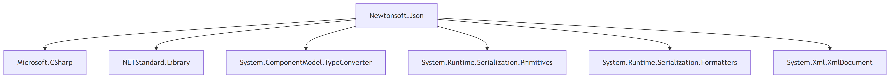

Разработать инструмент командной строки для визуализации графа зависимостей, включая транзитивные зависимости. Сторонние средства для получения зависимостей использовать нельзя.

Зависимости определяются по имени пакета платформы .NET (nupkg). Для описания графа зависимостей используется представление Mermaid. Визуализатор должен выводить результат в виде сообщения об успешном выполнении и сохранять граф в файле формата png.

Ключами командной строки задаются:
* Путь к программе для визуализации графов.
* Имя анализируемого пакета.
* Путь к файлу с изображением графа зависимостей.
* URL-адрес репозитория.

Все функции визуализатора зависимостей должны быть покрыты тестами.

## Зависимости
```
pip install -r requirements.txt
```

## Команда для запуска проекта
```
# Пример команды запуска для графа зависимостей Newtonsoft.Json

python visualizer.py --visualizer_path ./visualizer.py --package_name Newtonsoft.Json --output_png_path ./output/output_graph_1.png --url https://www.nuget.org/api/v2/package/Newtonsoft.Json/13.0.3
```
## Команда для запуска юнит-тестов
```
python -m unittest ./tests/test_visualizer.py
```

## Результат юнит-тестов программы


## Результат работы программы



